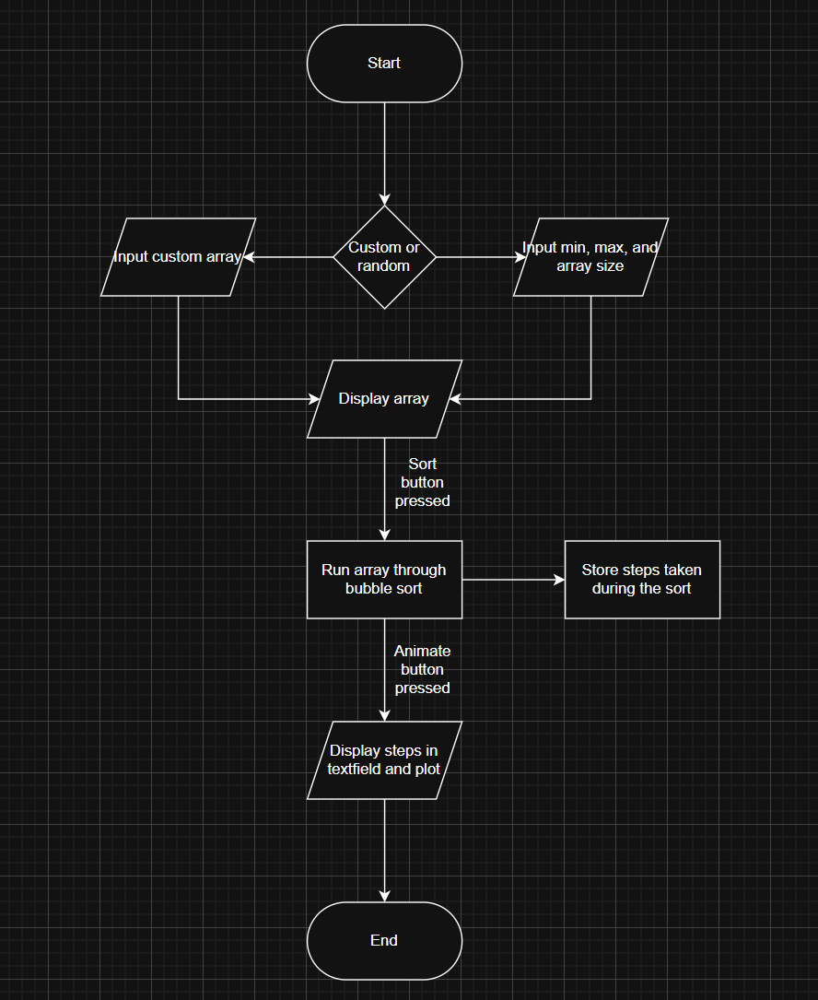

Check out the configuration reference at https://huggingface.co/docs/hub/spaces-config-reference
# Bubble Sort

## Demo

All of these can be individually accessed in the Demos folder

### Fresh Page

### Custom Array With Regular Input
<video controls src="Demos/custom-array-regular.mp4" title="Custom array with regular input"></video>

### Custom Array With Irregular Input
<video controls src="Demos/custom-array-irregular-input.mp4" title="Custom array with irregular input"></video>

### Random Array Generator
<video controls src="Demos/random-array.mp4" title="Random array generator"></video>

## Design Flow
I chose to use Bubble sort as my algorithm for a few reasons:
1. It is a very simple algorithm, meaning it is extremely easy to break down each step it takes to sort.
2. It is just visually appealing. It is easy to visually follow how the array is being sorted.

### Decomposition
Bubble sort is composed of a nested loop, one checking if an item has been swapped and one checking if we have reached the end of the unsorted list.

### Pattern Recognition
Every iteration, it first checks if the last pass had a swap. If it did, then we check if the index I is less than the length of the unsorted list. Finally, it checks if the value at the index is smaller than the value at the index i-1. If so, we do an in-place swap.

### Abstraction
I want to show the following:
- The different steps being taken by the algorithm
- The plot with highlights displaying the current state of the array
- The final sorted array

### Algorithm Design
The user will have two choices for inputs:
1. Custom array - The user will input their own array with whatever custom numbers they would like to sort.
2. Random array - The user will have three parameters to play around with: min number, max number, and the array size. This will generate a random array with values between the min and max values.

The output is firstly a display showing the unsorted array, once it has been generated. After that, the user can press the "sort" button, and the display will update to reflect the sort. Finally, the user can press the "run animation" button to display each step in a text field, and also see the change visually on a bar plot.

## Running the App
The app should be able to be accessed via the hugging face link. No other steps should be necessary to make. 

To run the app locally, clone the repository from the Git Hub website, and run python app.py. Make sure all dependencies in requirements.txt are installed. NOTE THAT GRADIO 6.0.1 DOES NOT
WORK, AND WILL BREAK THE CODE. More details on this below. 

## Hugging Face Link
https://huggingface.co/spaces/waffleshd/gradio-bubble-sorter

## Author and Acknowledgement
Name: Liam Klein
ID: 20523667

The majority of app.py is written by Copilot (most functionality of buttons, etc. done manually). Functions.py was written entirely by me, save for a few bugfixes.

In app.py, I have asked Copilot to mark anything it has done with AI CHANGE or something similar for reference.
