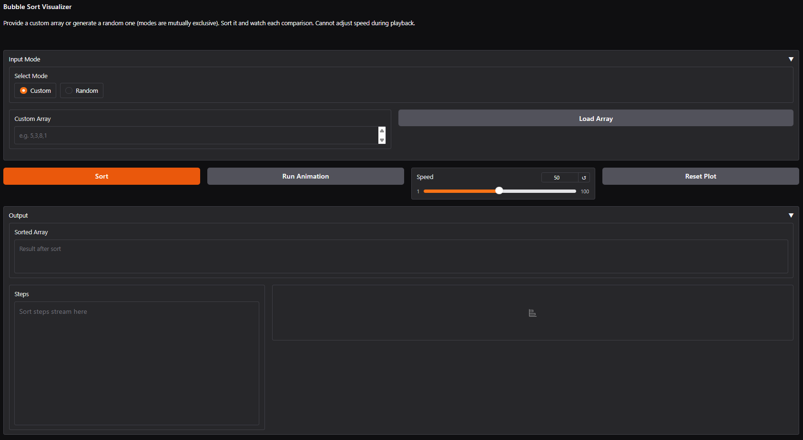

Check out the configuration reference at https://huggingface.co/docs/hub/spaces-config-reference
# Bubble Sort

## Demo

All of these can be individually accessed in the Demos folder

### Fresh Page

### Custom Array With Regular Input
<video controls src="Demos/custom-array-regular.mp4" title="Custom array with regular input"></video>

### Custom Array With Irregular Input
<video controls src="Demos/custom-array-irregular-input.mp4" title="Custom array with irregular input"></video>

### Random Array Generator
<video controls src="Demos/random-array.mp4" title="Random array generator"></video>

## Running the App
The app should be able to be accessed via the hugging face link. No other steps should be necessary. 

To run the app locally, clone the repository from the Git Hub website, and run python app.py. Make sure all dependencies in requirements.txt are installed. NOTE THAT GRADIO 6.0.1 DOES NOT
WORK, AND WILL BREAK THE CODE. More details on this below. 

## Hugging Face Link
https://huggingface.co/spaces/waffleshd/gradio-bubble-sorter

